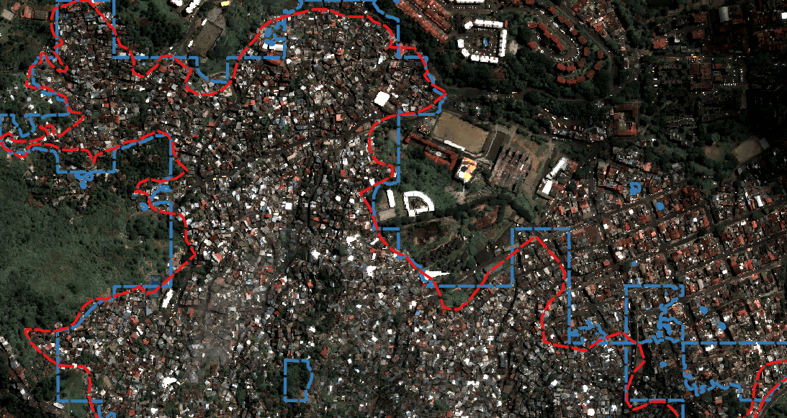
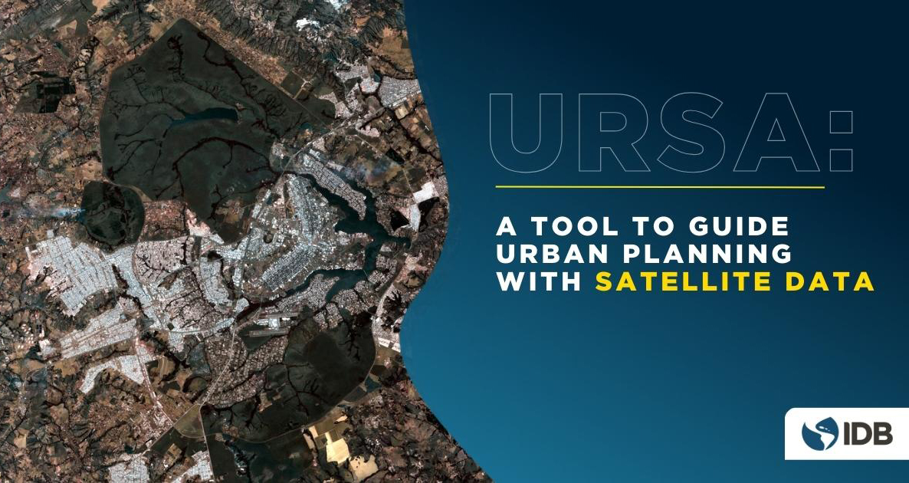
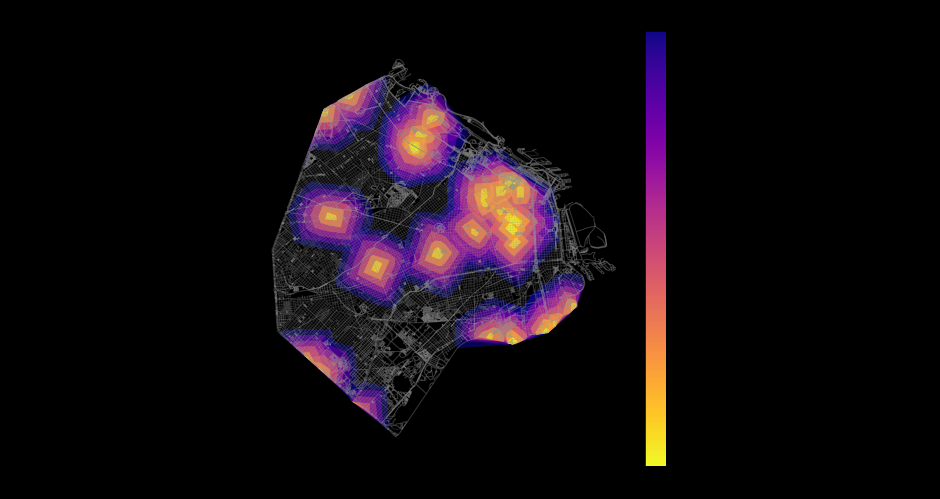
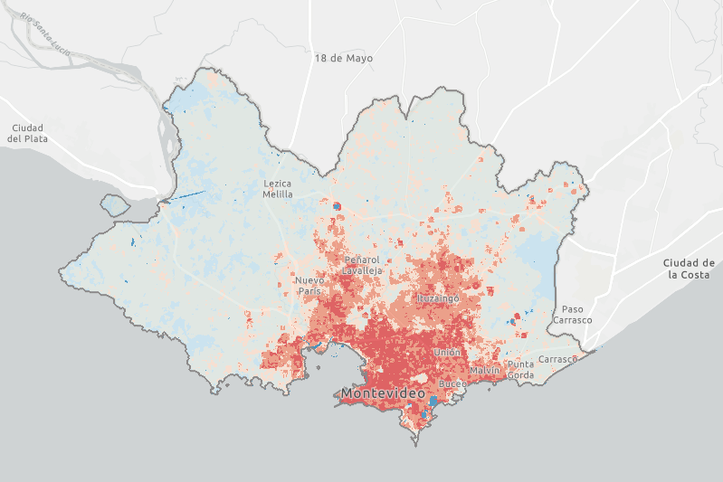
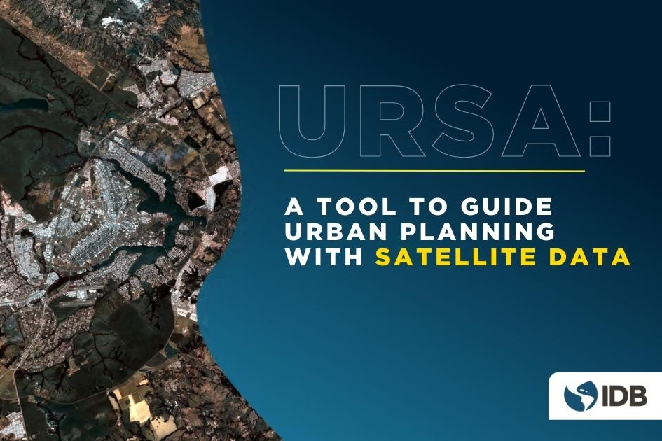
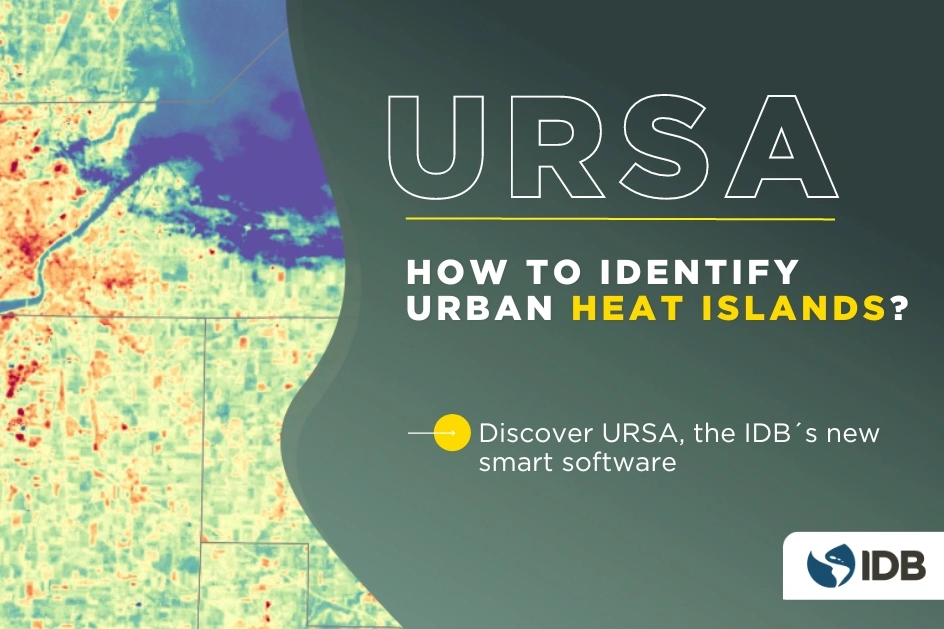
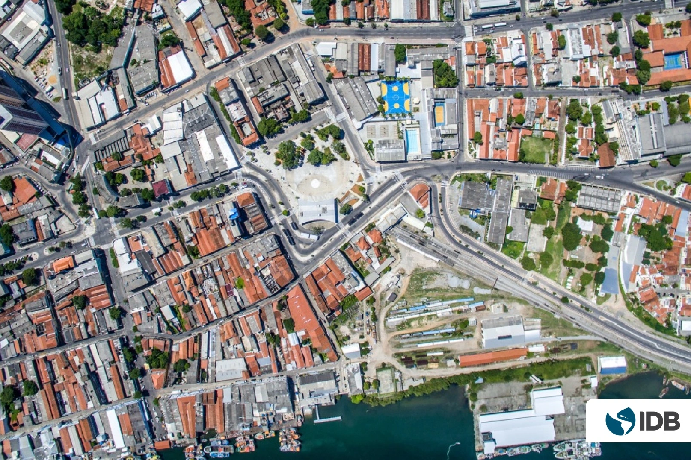
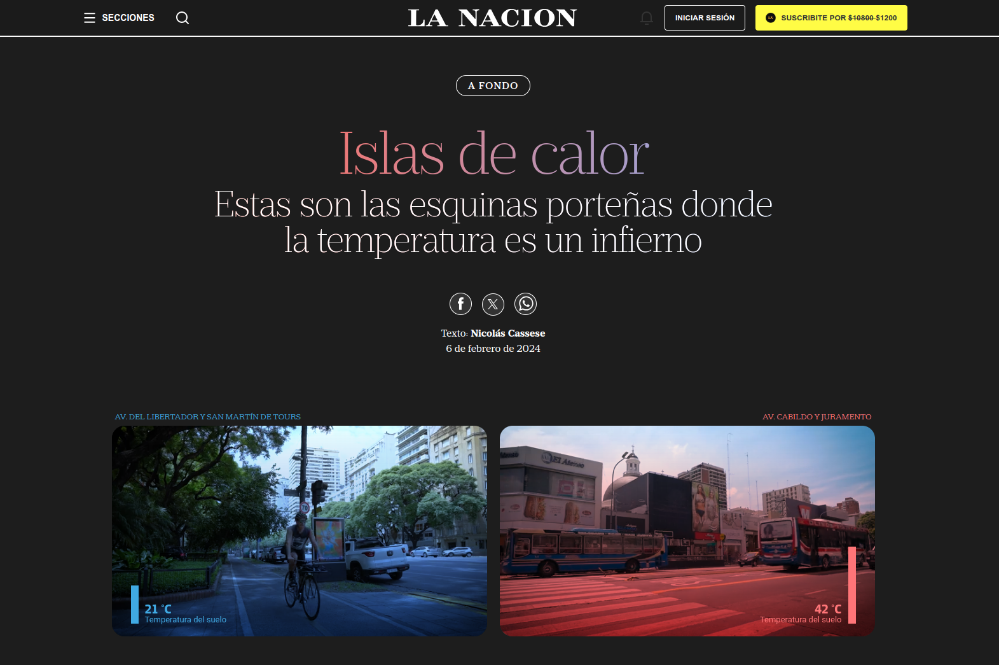
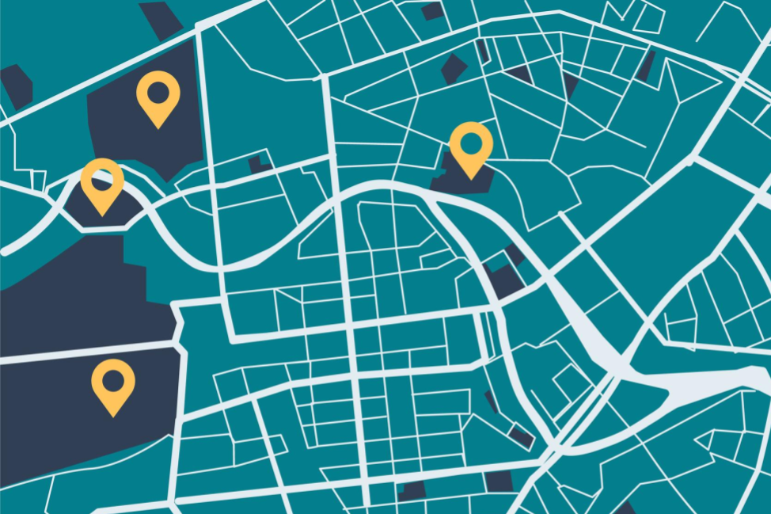

# Open Urban Planning Toolbox
## Developed by the <a href="https://www.iadb.org/en/who-we-are/topics/urban-development-and-housing">IDB’s Housing and Urban Development Division</a>, open to all.

**A set of open-source tools to support each step of the urban development planning process, from early design through implementation and evaluation of projects.**

# [MAIIA](https://github.com/EL-BID/MAIIA)
[MAIIA](https://github.com/EL-BID/MAIIA) is an AI algorithm that allows for the automated mapping of informal urban settlement locations through the analysis of satellite images. It was developed with an emphasis on ease of implementation, to lower the barriers to access artificial intelligence tools and enable government agencies, researchers, and other interested parties to apply it to their own use cases.

# [URSA](https://github.com/EL-BID/URSA)
[URSA](https://github.com/EL-BID/URSA) (**U**rban **R**eporting based on **S**atellite **A**nalysis) is a support system for urban planning. It allows easy access to the enormous amount of information captured by satellite sensors, taking charge of collecting, processing and presenting key information about the evolution of cities in Latin America and the Caribbean.

  

# [UrbanPy](https://github.com/EL-BID/urbanpy)
[UrbanPy](https://github.com/EL-BID/urbanpy) makes it easy to obtain digital maps with the geographical boundaries of any city, estimate its population with high granularity, locate points of interest such as schools or hospitals, and even calculate travel times through the local street system. All of this is done using global open databases. These functions were developed to facilitate the easy acquisition of urban accessibility indicators, determining the distance of the population to key service points (pharmacies, hospitals, banks, schools, etc.), and generating detailed maps that indicate the degree of isolation of each sector and the amount of affected population.
 

# News & Publications
### Recent articles and reports showcasing applications of the Open Urban Planning Toolbox
<table>
  
  <tr>
    <td><h4>Identifying Urban Heat Islands in Montevideo with URSA</h4>
      Montevideo City's Territorial Observatory uses URSA to monitor Urban Heat Islands, supporting data-driven decisions for the implementation of territorial policies (full text in Spanish).
 <a href="https://blogs.iadb.org/ciudades-sostenibles/es/identificando-islas-de-calor-en-montevideo-para-la-planificacion-de-una-ciudad-sostenible/">Read more</a></td>
    <td>
    </td>
  </tr>
  
  <tr>
    <td><h4>Neighborhoods, Big Data & AI - Technology for Urban Integration</h4>
      MAIIA's technology is explained in the “Neighborhoods, Big Data and AI” episode of *Inteligencia Urbana*, the official podcast from the IDB Cities Lab.
 <a href="https://open.spotify.com/episode/34jiJSdCY9YG5yUWmbbU1y">Listen to the episode</a>
    </td>
    <td></td>
  </tr>
  
  <tr>
    <td><h4>How to identify heat islands in cities?</h4>
Explora el visor de islas de calor urbanas de URSA que actualmente está disponible para ciudades en América Latina y el Caribe con más de 100,000 habitantes. <a href="https://blogs.iadb.org/ciudades-sostenibles/en/how-to-identify-heat-islands-in-cities-discover-ursa-the-new-intelligent-software-from-the-idb/">Read more</a></td>
    <td></td>
  </tr>
  
  <tr>
    <td><h4>URSA: A Tool to Guide Urban Planning with Satellite Data</h4>
The IDB Cities Laboratory and the Center for the Future of Cities at Tecnológico de Monterrey collaborated to create URSA, a digital system that simplifies the access and analysis of satellite data. <a href="https://blogs.iadb.org/ciudades-sostenibles/en/ursa-a-tool-to-guide-urban-planning-with-satellite-data/">Read more</a>
    </td>
    <td></td>
  </tr>
  
  <tr>
    <td><h4>Can Artificial Intelligence Help Reduce Urban Informality?</h4>
MAIIA has been used in Colombia to analyze satellite images and provide information on where and how informal settlements are growing. <a href="https://blogs.iadb.org/ciudades-sostenibles/en/can-artificial-intelligence-help-reducing-urban-informality/">
Read more</a>
    </td>
    <td></td>
  </tr>
  
  <tr>
    <td><h4>Discover the Buenos Aires street corners where temperatures are scorching</h4>
Argentine newspaper La Nación used URSA to present infographics and maps of the heat island effect in the City of Buenos Aires (in Spanish). <a href="https://www.lanacion.com.ar/sociedad/islas-de-calor-portenas-tenes-calor-entonces-ni-te-asomes-a-estas-esquinas-portenas-donde-la-nid06022024/">Read more</a>
    </td>
    <td>
    </td>
  </tr>
  
  <tr>
    <td><h4>UrbanPy, a comprehensive tool for urban accessibility analysis</h4>
Presenting UrbanPy, the tool that allows you to define geographic boundaries of a city, estimate population, locate points of interest, and calculate travel times.  <a href="https://blogs.iadb.org/conocimiento-abierto/es/urbanpy-herramienta-analisis-accesibilidad-urbana/">Read more</a>
    </td>
    <td></td>
  </tr>
  
</table>
